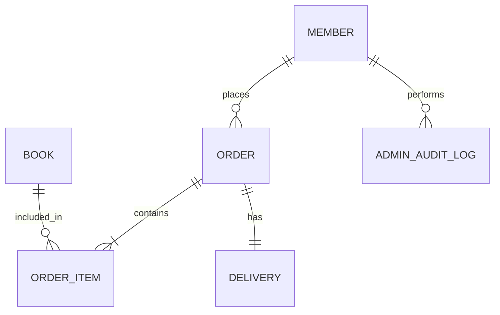

# Database Schema Design

## 1. Overview
- **Naming Convention:** snake_case (PostgreSQL 호환성 고려)
- **Primary Key:** `bigint` (Auto Increment)
- **Audit:** 모든 테이블에 `created_at`, `updated_at` 컬럼 포함 (JPA Auditing)

## 2. Tables & Relationships

### 2.1 Member (회원)
- **`members`**
  - `id` (PK)
  - `email` (Unique, 로그인 ID)
  - `password` (Encrypted)
  - `name`
  - `role` (USER, ADMIN)
    - *Note:* Keycloak 도입 시 `role` 컬럼은 Keycloak의 Role Mapping 정보와 동기화되거나, DB 내에서는 최소한의 정보만 유지할 수 있음.
  - `address_city`, `address_street`, `address_zipcode` (Embedded Address)

### 2.2 Catalog (도서)
- **`books`**
  - `id` (PK)
  - `title`
  - `author`
  - `price`
  - `stock_quantity` (재고 수량)
  - `isbn` (Unique)
  - `category`

### 2.3 Order (주문)
- **`orders`**
  - `id` (PK)
  - `member_id` (FK -> members.id)
  - `status` (PENDING, PAID, SHIPPED, DELIVERED, CANCELLED)
  - `total_amount`
  - `ordered_at`

- **`order_items`**
  - `id` (PK)
  - `order_id` (FK -> orders.id)
  - `book_id` (FK -> books.id)
  - `order_price` (주문 당시 가격)
  - `count` (주문 수량)

### 2.4 Delivery (배송)
- **`deliveries`**
  - `id` (PK)
  - `order_id` (FK -> orders.id, 1:1 관계)
  - `status` (READY, COMP, CANCEL)
  - `address_city`, `address_street`, `address_zipcode` (배송지 주소)

### 2.5 Administration (관리자)
- **`admin_audit_logs`**
  - `id` (PK)
  - `admin_id` (FK -> members.id)
  - `action` (e.g., "VIEW_ALL_MEMBERS", "CANCEL_ORDER")
  - `target_id` (대상 리소스 ID, Optional)
  - `details` (JSON Text, Arguments)
  - `created_at`

## 3. ER Diagram (Conceptual)

