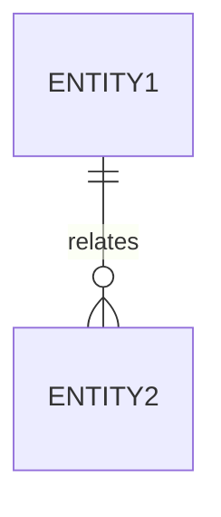

# Database Schema Design

## 1. Overview
- **Naming Convention:** snake_case (PostgreSQL 호환성 고려)
- **Primary Key:** `bigint` (Auto Increment)
- **Audit:** 모든 테이블에 `created_at`, `updated_at` 컬럼 포함 (JPA Auditing)

## 2. Tables & Relationships

### 2.1 [Domain 1]
- **`table_name`**
  - `id` (PK)
  - `column_name`
  - ...

### 2.2 [Domain 2]
- **`table_name`**
  - `id` (PK)
  - `column_name`
  - ...

## 3. ER Diagram (Conceptual)

